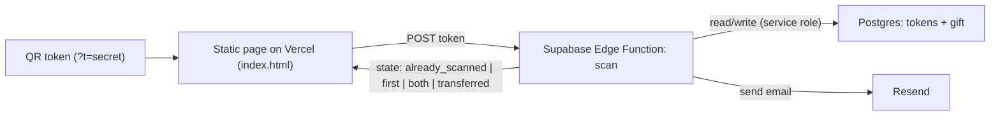

# QR Token Gift App

A two-token birthday gift flow. Each paper token holds a QR code pointing at a static page with a secret token id. The page calls a Supabase Edge Function that records the scan, emails you, and returns the current state so the page can render the right message.

## Architecture

## State logic (computed by the edge function)
The function checks whether this token's `scanned_at` was *already set before this request* (a repeat) vs newly set, and returns both the overall state and an `alreadyScanned` flag.
- This token was already scanned (repeat) and the other token is still unscanned -> `already_scanned` -> page shows "You already scanned this token. Scan the other one."
- Exactly one of the two tokens scanned (this being its first scan) -> `first` -> page shows "Scan the other token".
- Both tokens scanned, `gift.status = 'pending'` -> `both` -> page shows "Your tokens will be transferred. Please wait 24 hours to complete." (Re-scanning either token once both are done also lands here, not on the already-scanned message.)
- `gift.status = 'transferred'` (you set this manually) -> `transferred` -> page shows a final confirmation message.
- Either order works; tokens are matched by their secret value, not position.

## Data model (Supabase / Postgres)
- `tokens`: `token text primary key` (long random secret), `label text` ('A'/'B'), `scanned_at timestamptz null`.
- `gift`: single row, `status text not null default 'pending'` ('pending' | 'transferred').
- RLS: enabled with no public policies. Only the edge function (service role) touches these tables; the browser never talks to Postgres directly. Secrets in the URL are long/random so guessing is infeasible.

## Notifications
- Resend, called from the edge function. To avoid domain setup for a one-off, send `from: onboarding@resend.dev` to your own address (`NOTIFY_EMAIL`). Works out of the box on Resend's free tier when sending to the account owner's email.
- Email on the first scan of each token (2 emails) so a page refresh doesn't spam you; the "both scanned" email doubles as the transfer-pending alert. (Easy to switch to "every scan" if you prefer.)

## Components to build
- `supabase/migrations/0001_init.sql` - create tables, enable RLS, seed `gift` row and the two `tokens` rows with generated secrets.
- `supabase/functions/scan/index.ts` - Deno edge function: validate token, detect repeat vs first scan, set `scanned_at` only if null (and email on that first scan), compute + return `{ state, alreadyScanned }`. Reads `SUPABASE_SERVICE_ROLE_KEY`, `RESEND_API_KEY`, `NOTIFY_EMAIL` from env/secrets.
- `web/index.html` (+ small inline CSS/JS) - reads `?t=`, POSTs to the edge function, renders one of the four messages (already-scanned, scan-the-other, transfer-pending, transferred) with a clean, mobile-friendly UI. Pure static, no build step.
- `vercel.json` - static deploy config for the `web/` folder.
- `scripts/generate-qr.mjs` - uses the `qrcode` package to write two printable PNGs (`token-A.png`, `token-B.png`) from the deployed URL + each secret.
- `README.md` - setup + the manual "set status to transferred in Supabase" step.

## Manual transfer step
After you complete the real-world transfer, open the Supabase table editor and set `gift.status = 'transferred'`. Next time your nephew opens either token link, the page shows the transferred confirmation.

## Setup sequence (after files exist)
1. Create Supabase project; run the migration.
2. Deploy the `scan` edge function; set secrets `RESEND_API_KEY`, `NOTIFY_EMAIL` (and service role key, provided by Supabase).
3. Deploy `web/` to Vercel; note the URL.
4. Run `node scripts/generate-qr.mjs <vercel-url>` to produce the two QR PNGs; print and post them.

## Open defaults (chosen, easy to change)
- Final message text: "Your tokens have been transferred. Enjoy!"
- Notify on first scan per token (not on every refresh).
